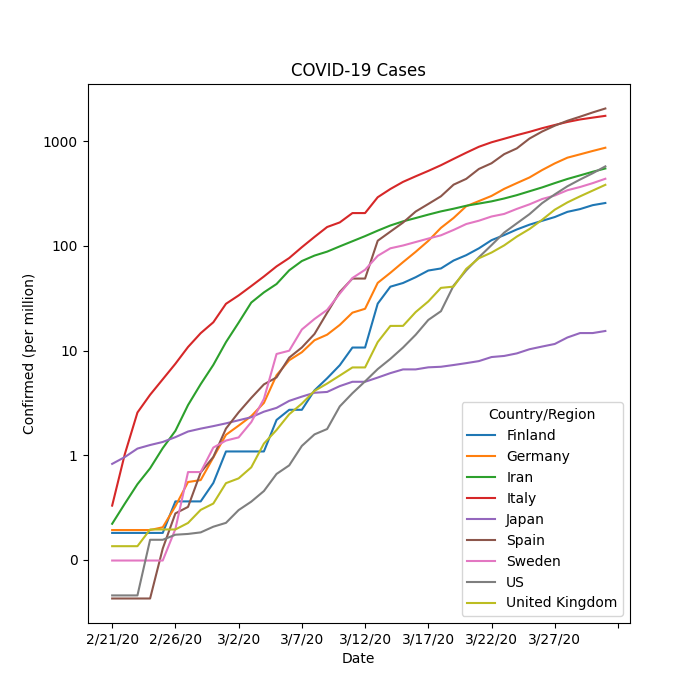

# Coronavirus Logarithmic Chart (per Country)

Python script for plotting the [COVID-19](https://www.who.int/emergencies/diseases/novel-coronavirus-2019) cases on a logarithmic scale for selected countries.  
Pulls and renders data from the [Johns Hopkins data repository](https://github.com/CSSEGISandData/COVID-19).  
To select countries, edit the `population` variable. 

```bash
usage: plot.py [-h] [-d DATASET] [-l] [-pc]

optional arguments:
  -h, --help            show this help message and exit
  -d DATASET, --data DATASET
                        dataset (default: confirmed), possible values:
                        confirmed, recovered, deaths
  -l, --linear          use linear scale (default: false)
  -pc, --per-capita     show values per million people (default: false)
```



## Running 
This script generates a .png file in the same directory. It uses Python 3.7, Pandas and Matplotlib.

### Running with [pipenv](https://github.com/pypa/pipenv)
```bash
# Install dependencies 
pipenv install
# Open virtual environment
pipenv shell
# Run the script
python3 plot.py
```

### Running without pipenv
```bash
# Install dependencies
pip3 install pandas matplotlib
# Run the script
python3 plot.py
```

---
The script is for indicative purposes only and provided "as-is", "with all faults" and "as available". There are no guarantees for the accuracy or timeliness of information generated by this script.
